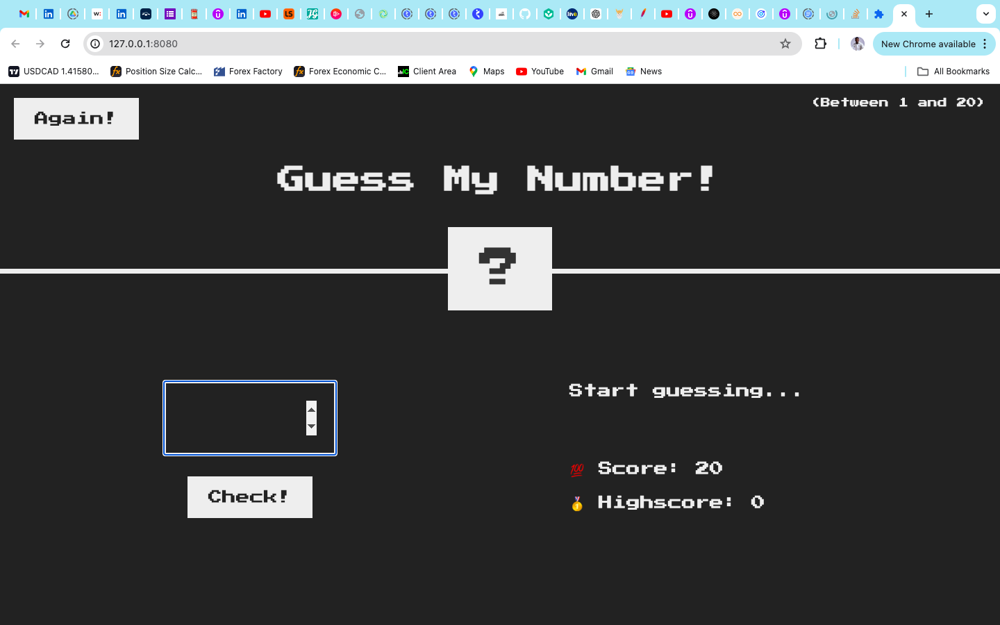
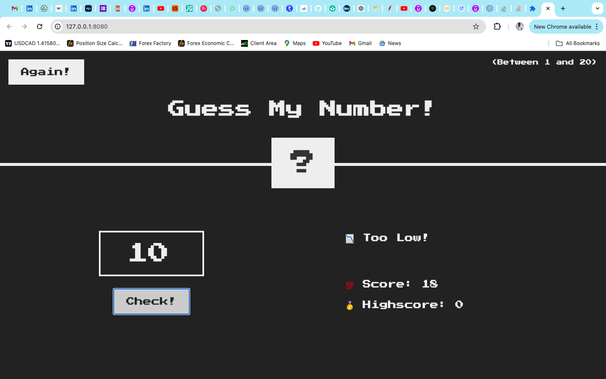
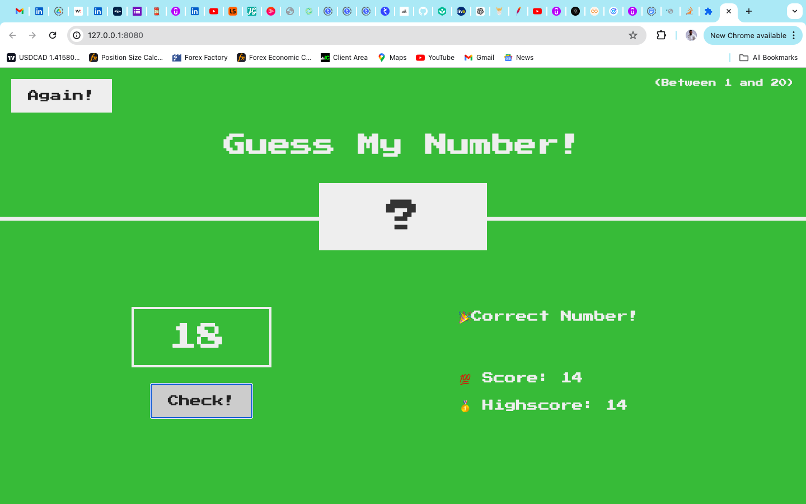

# Guess-My-Number-Game

Welcome to the Guess My Number Game! This is a simple web-based game where the player tries to guess a randomly generated number within a specified range. The game provides feedback to the player indicating whether their guess is too high, too low, or correct.

## Table of Contents

* Features
*Technologies
* Setup
* How to Play
* Contributing
*License

### Features
+ Random number generation within a specified range
+ User input for guesses
+ Feedback on whether the guess is too high, too low, or correct
+ Score tracking
+ Responsive design for various screen sizes

### Technologies

* HTML
* CSS
* JavaScript

### How to Play

+ The game will generate a random number between a specified range (e.g., 1 to 20).
+ Enter your guess in the input field and click the "Check!" button.
+ The game will provide feedback:
+ If the guess is too high, it will display "Too high!"
+ If the guess is too low, it will display "Too low!"
+ If the guess is correct, it will display "Correct!" and the game is won.
+ The game tracks your score based on the number of attempts.
+ Click the "Again!" button to reset the game and play again.
